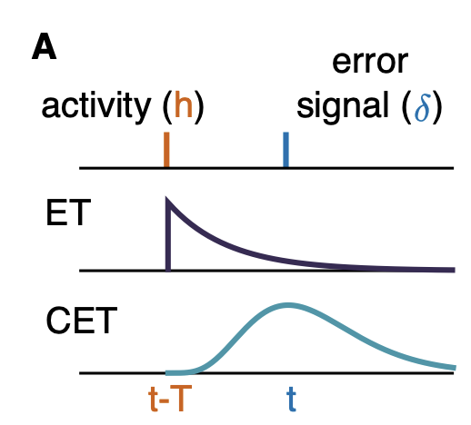
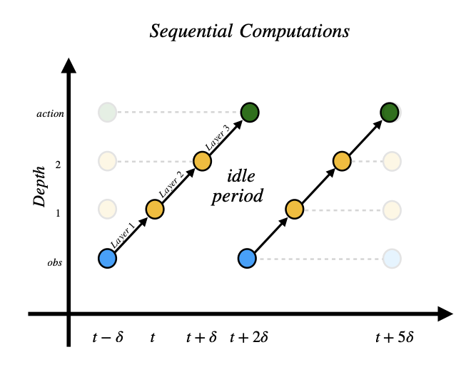

{width=200 .float-end .ms-3 .mb-2}

# Ivan Anokhin

_PhD student at **Mila / Université de Montréal**._

I am a PhD student at Mila / Université de Montréal, advised by [Irina Rish](https://sites.google.com/view/irinarish/). I am driven by a fundamental interest in the nature of intelligence. My broader research spans scalable reinforcement learning, memory mechanisms, continual learning, and (multi)-agency.

My current core PhD research applies asynchronous computation to design new architectures and pipelines that break the sequential layer execution of standard neural networks. The goal is to build scalable, wall-clock efficient, low-latency agents that are closer to biological intelligence.

Before Mila, I was lucky to work with [Victor Lempitsky](https://scholar.google.com/citations?user=gYYVokYAAAAJ&hl=en) at Samsung AI Center and [Dmitry Yarotsky](https://scholar.google.com/citations?user=wNSSr_gAAAAJ&hl=en) at Skoltech. I also worked at Yandex and earned my BSc from Saint Petersburg State University.

**Links:** [Email](mailto:i.anokhin.mm@gmail.com) · [CV](files/CV.pdf) · [Google Scholar](https://scholar.google.com/citations?user=CJ-86AYAAAAJ&hl=en&oi=ao) · [GitHub](https://github.com/avecplezir) · [Twitter/X](https://x.com/plaisir_avec) · [LinkedIn](https://www.linkedin.com/in/ivan-anokhin-914384131/) 

---

## News
- 2026-03 - Will join Sakana AI as an intern for summer 2026.
- 2026-02 - Supported by the Université de Montréal AI scholarship.
- 2026-01 - [Learning From the Past with Cascading Eligibility Traces](https://arxiv.org/abs/2506.14598) was accepted to ICLR 2026.
- 2026-01 - Published my first blog post: [Why Civilization Goes Virtual](posts/future-of-civilization-virtual-black-ball/).
- 2025-12 - Passed Predoc-3 (mid-PhD committee exam). Topic: “Toward Asynchronous Computation for Streaming RL.”
- 2025-10 - Launched this website! 🎉
- 2025-07 - Preprint on bio-plausible learning rule that handles delayed credit assignment is out! 🎉
- 2025-07 - [Mila blog post](https://mila.quebec/en/article/real-time-reinforcement-learning) on real-time RL is out. 

---

<!--
## Selected publications {#publications}

  
  

  
[Learning From the Past with Cascading Eligibility Traces](https://arxiv.org/abs/2506.14598)

  
Tokiniaina Raharison Ralambomihanta\*, **Ivan Anokhin**\*, Roman Pogodin\*, Samira Ebrahimi Kahou, Jonathan Cornford, Blake Aaron Richards

  
 ICLR 2026 

  
[[PDF](https://arxiv.org/pdf/2506.14598), [Code](https://github.com/avecplezir/CET)]

  
We show how to handle delayed credit assignment in an online, bio-plausible fashion by employing SSMs to retain past activations. We demonstrate the applicability of our method on computer vision and RL tasks. The design is friendly to on-device learning and Streaming RL. 

  

  
  

  
[Handling Delay in Real-Time Reinforcement Learning](https://arxiv.org/abs/2503.23478)

  
**Ivan Anokhin**, Rishav Rishav, Matthew Riemer, Stephen Chung, Irina Rish, Samira Ebrahimi Kahou

  
 ICLR 2025 

  
 [[PDF](https://arxiv.org/pdf/2503.23478), [Code](https://github.com/avecplezir/realtime-agent), [Blog post](https://mila.quebec/en/article/real-time-reinforcement-learning), [Poster](images/pubs/realtime_poster.png)] 

  
We address real-time RL by pipelining layer computations and handling observation delay. We show it leads to faster inference and competitive performance on MuJoCo and MinAtar. The design is also friendly to on-device inference.

  

A full publication list is available [here](publications.qmd).
-->
